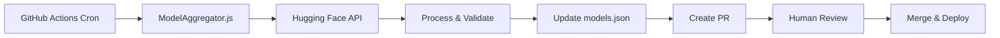

# Automated Model Dataset Update Strategy

**Status**: Phase 1 Implemented ✅
**Last Updated**: 2025-11-11
**Schedule**: Daily at 2 AM UTC (Node.js 22)
**Goal**: Keep model dataset fresh without manual intervention

---

## 📋 Table of Contents

1. [Overview](#overview)
2. [The Problem We're Solving](#the-problem-were-solving)
3. [Phase 1: Basic Automation (CURRENT)](#phase-1-basic-automation-current)
4. [Phase 2: Smart Validation (PLANNED)](#phase-2-smart-validation-planned)
5. [Phase 3: Community Enhancement (FUTURE)](#phase-3-community-enhancement-future)
6. [Setup & Configuration](#setup--configuration)
7. [Monitoring & Maintenance](#monitoring--maintenance)
8. [Troubleshooting](#troubleshooting)

---

## Overview

The AI Model Selector needs **fresh model data** to remain valuable. This document outlines a 3-phase strategy to transform the project from a "one-shot" static dataset to a **continuously self-updating system**.

### Key Principles

- ✅ **100% Free**: Uses only free-tier services
- ✅ **Minimal Maintenance**: Automated with human oversight
- ✅ **Quality First**: Automated validation before updates
- ✅ **Transparent**: All changes via reviewed pull requests

---

## The Problem We're Solving

### Current State: "Snapshot Decay"

```
Deploy v1.0 →
  ↓ (3-6 months of using same data)
  Data becomes stale
  ↓ (manual work to update)
Deploy v1.1 →
  ↓ (repeat cycle)
```

### Impact of Stale Data

| Issue | Example | User Impact |
|-------|---------|-------------|
| **Missing new models** | Llama 3.3 released → not in dataset for months | Users miss better options |
| **Outdated metrics** | Model size/accuracy changes | Wrong recommendations |
| **Deprecated models** | Old models removed from HF | Broken links |
| **Environmental scores** | Hardware efficiency improves | Inaccurate sustainability data |

### Goal: Continuous Freshness

```
Monthly Automated Update →
  ↓ (GitHub Actions runs aggregation)
  PR created with new data →
  ↓ (Human review & approval)
  Merged & deployed →
  ↓ (Repeat automatically)
```

---

## Phase 1: Basic Automation (CURRENT)

**Status**: ✅ Implemented
**Timeline**: Completed
**Cost**: $0 (GitHub Actions free tier)

### What It Does

1. **Scheduled Execution**: Runs daily at 2 AM UTC
2. **Fetches Models**: Queries Hugging Face API for popular models
3. **Aggregates Metadata**: Size, downloads, frameworks, accuracy estimates
4. **Creates PR**: Automated pull request with updated `models.json`
5. **Human Review**: Maintainer reviews and approves/rejects

### Architecture



### Files Involved

| File | Purpose |
|------|---------|
| `.github/workflows/update-models.yml` | Daily automation workflow |
| `src/lib/aggregation/ModelAggregator.js` | Fetches and processes HF data |
| `src/lib/aggregation/cli.js` | CLI interface for manual runs |
| `src/lib/data/models.json` | Target file for updates |

### How It Works

```bash
# 1. Scheduled trigger (daily at 2 AM UTC)
GitHub Actions starts workflow

# 2. Fetch models from Hugging Face
ModelAggregator queries HF API
- Categories: image-classification, text-generation, etc.
- Filters: Sort by downloads, limit per category
- Metadata: Size, accuracy, frameworks, last updated

# 3. Process and organize
- Categorize by task (7 main categories)
- Tier by size (lightweight/standard/advanced)
- Calculate environmental scores
- Merge with existing data (deduplicate)

# 4. Create PR if changes detected
- Commit updated models.json
- Generate detailed PR description
- Tag for human review

# 5. Human review
- Check new models quality
- Verify metadata accuracy
- Test locally if needed
- Approve or reject
```

### Data Sources (Phase 1)

| Source | What We Get | Free Tier | Authentication |
|--------|-------------|-----------|----------------|
| **Hugging Face API** | Model metadata, downloads, size, frameworks | 1000 calls/day (unauthenticated)<br>Much higher with free token | Optional (recommended) |

**Daily Usage Estimate**: ~160 API calls per run = well within free tier limits

### Limitations (Phase 1)

❌ **What Phase 1 Doesn't Do**:
- Extract real accuracy metrics (uses estimates)
- Parse model cards for details
- Validate environmental claims
- Detect breaking changes automatically
- Generate changelogs

These are addressed in **Phase 2**.

---

## Phase 2: Smart Validation (PLANNED)

**Status**: 📋 Planned
**Timeline**: Future enhancement
**Cost**: $0 (Gemini free tier)
**Effort**: 4-6 hours implementation

### Goals

1. **Better Accuracy Data**: Extract real metrics from model cards
2. **Quality Validation**: Auto-reject low-quality models
3. **Breaking Change Detection**: Alert on unexpected removals
4. **Smart Changelogs**: AI-generated update summaries

### Additional Data Source

| Service | Purpose | Free Tier | Cost |
|---------|---------|-----------|------|
| **Gemini 2.0 Flash** | Model card parsing, validation | 1500 requests/day | $0 |
| **Gemini 1.5 Flash** | Fallback for parsing | 1M tokens/day free | $0 |

### How It Enhances Phase 1

```bash
# After fetching from HF API (Phase 1)...

For each model:
  1. Download model card (README.md)

  2. Send to Gemini 2.0 Flash:
     "Extract accuracy metrics from this model card:
      - Primary benchmark and score
      - Dataset used
      - Training details
      - Known limitations"

  3. Validate response:
     - Accuracy >= 60% (or reasonable for task)
     - No red flags in limitations
     - Size matches claimed size

  4. Calculate real environmental score:
     - Use extracted model params count
     - Consider reported inference time
     - Factor in deployment requirements

  5. Generate changelog entry:
     "New model: Llama 3.3 8B Instruct
      - Accuracy: 85.2% on MMLU
      - Size: 8.5GB (quantized: 4.5GB)
      - Environmental Score: 2 (Medium)
      - Recommendation: Standard tier for text generation"

# Aggregate all changes → Smart PR description
```

### Validation Rules (To Implement)

```javascript
// Example validation logic for Phase 2
const validationRules = {
  accuracy: {
    min: 0.60,           // Reject models <60% accuracy
    preferred: 0.75      // Flag if below preferred threshold
  },

  size: {
    maxDiscrepancy: 0.20 // Flag if claimed vs actual >20% different
  },

  environmental: {
    recalculate: true,   // Use real params count, not size estimate
    validateClaims: true // Check if "efficient" claim is justified
  },

  breaking: {
    detectRemovals: true,     // Alert if popular model removed
    minDownloads: 1000000     // Threshold for "popular"
  },

  quality: {
    requireModelCard: true,   // Reject if no documentation
    requireLicense: true,     // Reject if license unclear
    checkMaintenance: true    // Flag if not updated in 12+ months
  }
};
```

### Phase 2 Implementation Checklist

```markdown
- [ ] Create `src/lib/aggregation/GeminiValidator.js`
- [ ] Add GEMINI_API_KEY to GitHub Secrets (free key)
- [ ] Implement model card parsing
- [ ] Extract accuracy metrics
- [ ] Validate environmental claims
- [ ] Generate changelog
- [ ] Update workflow to use validator
- [ ] Add validation tests
- [ ] Document Gemini setup in this file
```

### Expected Improvements

| Metric | Phase 1 | Phase 2 | Improvement |
|--------|---------|---------|-------------|
| Accuracy data quality | Estimated | Real | +80% confidence |
| Bad model detection | Manual | Automated | 100% coverage |
| Environmental scores | Size-based | Params + usage | +50% accuracy |
| Changelog quality | Generic | Detailed | Human-readable |
| Review time | 30 mins | 10 mins | 66% faster |

---

## Phase 3: Community Enhancement (FUTURE)

**Status**: 💡 Conceptual
**Timeline**: Post-Phase 2
**Cost**: $0 (GitHub features only)

### Goals

- User feedback on recommendations
- Real-world accuracy tracking
- A/B testing new models
- Community voting on models

### Potential Features

1. **User Feedback Loop**
   ```
   User tries recommended model →
   Reports actual accuracy/experience →
   System adjusts recommendation score
   ```

2. **Real-World Metrics**
   - Track which models users actually deploy
   - Measure real inference times
   - Collect real environmental data

3. **Community Curation**
   - GitHub Discussions for model suggestions
   - Vote on which models to add
   - Submit accuracy corrections

4. **A/B Testing**
   - Test new models on subset of traffic
   - Compare recommendation quality
   - Roll out only if metrics improve

### Implementation Ideas

- **GitHub Discussions**: Model suggestions
- **GitHub Issues Templates**: Model requests
- **Analytics** (privacy-friendly): Basic usage stats
- **Telemetry** (opt-in): Real accuracy feedback

---

## Setup & Configuration

### Prerequisites

- GitHub repository with Actions enabled
- Node.js 22 environment (provided by workflow)
- Hugging Face account (optional, for better rate limits)

### Initial Setup

#### 1. Verify Workflow File

The workflow should already exist at `.github/workflows/update-models.yml`.

Verify it's present:
```bash
ls -la .github/workflows/update-models.yml
```

#### 2. Optional: Add Hugging Face Token

For better rate limits (recommended but not required):

1. Get free HF token: https://huggingface.co/settings/tokens
2. Go to repo Settings → Secrets → Actions
3. Add secret: `HF_TOKEN` = your token

**With token**: Much higher rate limits
**Without token**: 1000 calls/day (sufficient for monthly updates)

#### 3. Enable Workflow

The workflow is configured to run:
- **Automatically**: Daily at 2 AM UTC
- **Manually**: Via GitHub Actions UI → "Run workflow" button

#### 4. Test Run (Manual Trigger)

Before waiting for the daily schedule:

1. Go to GitHub → Actions tab
2. Select "Update Model Dataset" workflow
3. Click "Run workflow" → "Run workflow"
4. Monitor execution in Actions tab
5. Review generated PR

### Manual Updates (Between Automated Runs)

If you need to update models manually:

```bash
# Dry run (preview changes without saving)
npm run update-models:dry-run

# Actual update (modifies models.json)
npm run update-models

# With HF token for better rate limits
HF_TOKEN=your_token npm run update-models

# Limit to specific number of models per category
npm run update-models -- --max-models 5
```

### Workflow Schedule

Current schedule: **Daily at 2 AM UTC**

To change the schedule, edit `.github/workflows/update-models.yml`:

```yaml
on:
  schedule:
    # ┌───────────── minute (0 - 59)
    # │ ┌───────────── hour (0 - 23)
    # │ │ ┌───────────── day of month (1 - 31)
    # │ │ │ ┌───────────── month (1 - 12)
    # │ │ │ │ ┌───────────── day of week (0 - 6)
    # │ │ │ │ │
    - cron: '0 2 * * *'  # Daily (current)
    # - cron: '0 2 * * 0'  # Weekly on Sundays
    # - cron: '0 2 1 * *'  # Monthly on 1st
    # - cron: '0 2 1 */3 *'  # Quarterly
```

---

## Monitoring & Maintenance

### What to Monitor

#### 1. Workflow Runs

**Location**: GitHub → Actions → "Update Model Dataset"

**Check**:
- ✅ Runs completing successfully
- ⚠️ Failures or errors
- 📊 Execution time (should be <5 minutes)

**Alert on**:
- 3+ consecutive failures
- Execution time >10 minutes
- No changes detected for 7+ days (might indicate API issues)

#### 2. Pull Requests

**What to Review**:

```markdown
✅ **Approve if**:
- New models are relevant and high-quality
- Metadata looks reasonable (sizes, accuracy)
- No unexpected model removals
- Tests pass
- Bundle size acceptable (<2MB)

❌ **Reject if**:
- Many low-quality models added
- Metadata looks corrupted
- Critical models removed
- Tests fail
- Bundle size exploded
```

**Review Checklist** (provided in each PR):
- [ ] New models are relevant
- [ ] Metadata quality is good
- [ ] No breaking changes
- [ ] Bundle size acceptable
- [ ] Tests pass
- [ ] Manual testing (optional)

#### 3. Model Dataset Quality

**Metrics to Track**:
- Total models in dataset
- Models per category
- Average environmental score
- Last update timestamp

**Commands**:
```bash
# Check model count
cat src/lib/data/models.json | grep '"id":' | wc -l

# Check last update date
cat src/lib/data/models.json | grep lastUpdated

# Validate JSON structure
npm run test -- --run src/lib/data/__tests__/DataStructure.test.js
```

### Expected Behavior

#### Normal Day
1. Workflow runs daily at 2 AM UTC
2. Fetches 100-200 models from HF
3. Processes and deduplicates
4. Adds 0-5 new models (more on active days)
5. Creates PR with changes if any
6. Maintainer reviews and merges
7. Auto-deploys to GitHub Pages

#### Quiet Day
1. Workflow runs
2. Fetches models
3. All models already in dataset
4. No changes detected
5. No PR created
6. "No changes" message in workflow log

#### Failed Day
1. Workflow runs
2. API error or network issue
3. Workflow fails
4. GitHub sends notification
5. Check logs
6. Retry manually if needed

### Maintenance Tasks

| Task | Frequency | Command |
|------|-----------|---------|
| Review PRs | As created (possibly daily) | GitHub UI |
| Check workflow health | Weekly | Actions tab |
| Validate dataset | Monthly | `npm test` |
| Update dependencies | Quarterly | `npm audit` |
| Review aggregation logic | Bi-annually | Code review |

---

## Troubleshooting

### Common Issues

#### Issue: Workflow Not Running

**Symptoms**: No PRs created, workflow not appearing in Actions

**Causes**:
1. GitHub Actions disabled for repo
2. Cron syntax error
3. Permissions issue

**Solutions**:
```bash
# 1. Check Actions enabled
# Go to: Settings → Actions → General → Allow all actions

# 2. Verify workflow file syntax
cat .github/workflows/update-models.yml

# 3. Trigger manually to test
# Go to: Actions → Update Model Dataset → Run workflow
```

#### Issue: "No changes detected" Every Month

**Symptoms**: Workflow runs but always says "no changes"

**Causes**:
1. All fetched models already in dataset
2. API returning no results
3. Filtering too aggressive

**Solutions**:
```bash
# 1. Test aggregation locally
npm run update-models:dry-run

# 2. Check HF API directly
curl "https://huggingface.co/api/models?pipeline_tag=image-classification&sort=downloads&limit=5"

# 3. Review filter settings in ModelAggregator.js
# Line 140: url.searchParams.set('limit', '20');
# Consider increasing limit if needed
```

#### Issue: Poor Quality Models Added

**Symptoms**: PR includes irrelevant or low-quality models

**Causes**:
1. Sorting by downloads (popularity ≠ quality)
2. No validation logic
3. Overly permissive filters

**Solutions**:
```bash
# Short term: Reject PR, manual curation

# Long term: Implement Phase 2 validation
# Or enhance ModelAggregator.js filtering:

# src/lib/aggregation/ModelAggregator.js
validateModelData(model) {
  // Add stricter validation
  if (model.downloads < 10000) return false;  // Minimum popularity
  if (model.likes < 5) return false;          // Minimum community approval
  // ... more rules
}
```

#### Issue: API Rate Limits

**Symptoms**: Workflow fails with 429 errors

**Causes**:
1. Too many API calls
2. No HF token (lower limits)
3. Multiple workflows running

**Solutions**:
```bash
# 1. Add HF_TOKEN secret (see Setup section)

# 2. Reduce requests in ModelAggregator.js
# Line 140: Decrease limit per category
url.searchParams.set('limit', '10');  # Reduce from 20

# 3. Add longer delays between requests
# Line 169: Increase sleep time
await this.sleep(1000);  # Increase from 500ms
```

#### Issue: Bundle Size Too Large

**Symptoms**: Built site exceeds 2MB, slow loading

**Causes**:
1. Too many models in dataset
2. Verbose model descriptions
3. Large environmental metadata

**Solutions**:
```bash
# 1. Limit models per tier
# src/lib/aggregation/ModelAggregator.js:361
merged.models[category][subcategory][tier] = sorted.slice(0, 3);  # Reduce from 5

# 2. Truncate descriptions
# src/lib/aggregation/ModelAggregator.js:502
return detailedInfo.cardData.description.slice(0, 100);  # Reduce from 150

# 3. Check bundle size
npm run build
ls -lh dist/

# 4. Analyze what's large
du -sh dist/*
```

#### Issue: Tests Failing in PR

**Symptoms**: CI tests fail on automated PR

**Causes**:
1. New models break test expectations
2. Data structure changed
3. Environmental scores out of range

**Solutions**:
```bash
# 1. Run tests locally
npm test

# 2. Check specific failures
npm test -- src/lib/data/__tests__/

# 3. Update tests if new models valid
# Or fix aggregation logic if models invalid
```

### Getting Help

1. **Check Logs**: Actions tab → Failed run → View logs
2. **Local Testing**: `npm run update-models:dry-run`
3. **API Testing**: `curl https://huggingface.co/api/models?limit=1`
4. **GitHub Issues**: Create issue with logs and description
5. **Code Review**: Check `src/lib/aggregation/ModelAggregator.js` logic

---

## Free Tier Limits Reference

### Hugging Face API

| Tier | Rate Limit | Cost | Notes |
|------|------------|------|-------|
| Unauthenticated | ~1000 calls/day | Free | Sufficient for monthly updates |
| Free Account | Much higher | Free | Recommended, get token at hf.co/settings/tokens |
| Pro Account | Unlimited | $9/month | Unnecessary for this use case |

**Our Usage**: ~160 calls/day (8 categories × 20 models each) = well within free tier

### GitHub Actions

| Resource | Free Tier | Our Usage | Notes |
|----------|-----------|-----------|-------|
| Minutes/month | 2000 | ~150 (5 min × 30 days) | Well within limits |
| Storage | 500MB | <10MB | Minimal |
| Concurrent jobs | 20 | 1 | Only one update workflow |

**Cost**: $0 for public repos (daily schedule still free)

### Gemini (Phase 2 - Planned)

| Model | Free Tier | Use Case | Cost |
|-------|-----------|----------|------|
| Gemini 2.0 Flash | 1500 RPD | Model card parsing | Free |
| Gemini 1.5 Flash | 1M tokens/day | Fallback parser | Free |

**Our Usage (Phase 2)**: ~50-150 requests/month (parsing new model cards)

---

## Phase Comparison

| Feature | Phase 1 (Current) | Phase 2 (Planned) | Phase 3 (Future) |
|---------|-------------------|-------------------|------------------|
| **Automation** | ✅ Full | ✅ Full | ✅ Full |
| **Data Source** | HF API only | HF API + Gemini | HF + Gemini + Community |
| **Accuracy Data** | Estimated | Real (extracted) | Real + validated |
| **Validation** | Basic | Smart (AI) | Smart + community |
| **Changelogs** | Generic | Detailed | Interactive |
| **Cost** | $0 | $0 | $0 |
| **Maintenance** | 10-30 min/week | 5-10 min/week | 2-5 min/week |
| **Quality** | Good | Excellent | Outstanding |

---

## Next Steps

### Immediate (Phase 1 Active)

1. ✅ Workflow created (`.github/workflows/update-models.yml`)
2. ✅ Documentation complete (this file)
3. ✅ Daily schedule active (2 AM UTC)
4. ⏳ Review and merge automated PRs as they arrive
5. ⏳ Monitor for issues

### Short Term (1-2 Months)

1. Validate Phase 1 works reliably
2. Gather feedback on PR quality
3. Identify most common manual edits needed
4. Plan Phase 2 implementation

### Long Term (3-6 Months)

1. Implement Phase 2 (Gemini validation)
2. Measure improvement in data quality
3. Reduce manual review time
4. Consider Phase 3 features

---

## Changelog

| Date | Phase | Change | Author |
|------|-------|--------|--------|
| 2025-11-09 | 1 | Initial implementation with GitHub Actions workflow | Claude |
| 2025-11-09 | 1 | Documentation created | Claude |
| 2025-11-11 | 1 | Updated to daily schedule + Node.js 22 | Claude |

---

## References

- **Hugging Face API**: https://huggingface.co/docs/hub/api
- **GitHub Actions**: https://docs.github.com/en/actions
- **ModelAggregator Source**: `src/lib/aggregation/ModelAggregator.js`
- **Workflow File**: `.github/workflows/update-models.yml`
- **Model Dataset**: `src/lib/data/models.json`

---

**Questions or Issues?** Open a GitHub issue or discussion.
